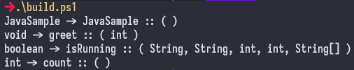

# Java Parsing
- A simple java parsing application that extracts the methods and prints the declarations.
- Using the Java files you can get the return type, method name and parameters base on the declarations.



# Installation
1. Copy or clone the repository
```shell
git clone https://github.com/AlfonsoG-dev/JavaParsing
```
2. Build the project
- This project uses my custom [build tool](https://github.com/AlfonsoG-dev/javaBuild) to create and run the main class.
```shell
javaBuild.exe --build
```
- You can use the *powersehll* script.
```shell
build.ps1
```
>- or in linux
```shell
./build.sh
```

# Disclaimer
- This project is for educational purposes.
- Security issues are not taken into account.
- Use it at your own **risk**.